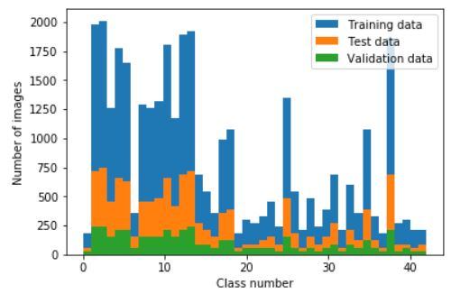
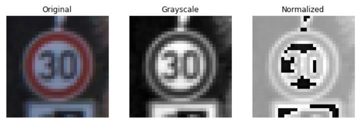
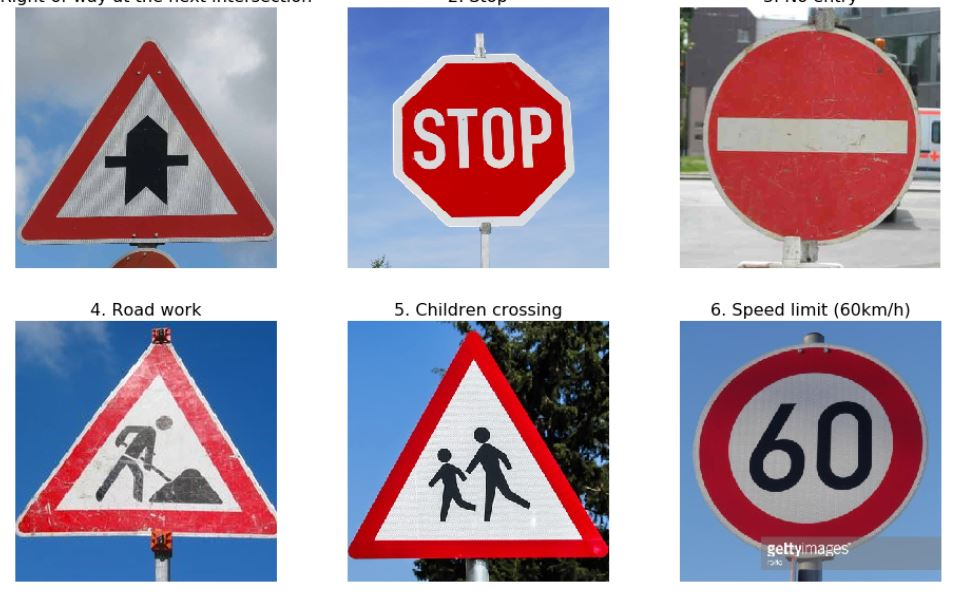
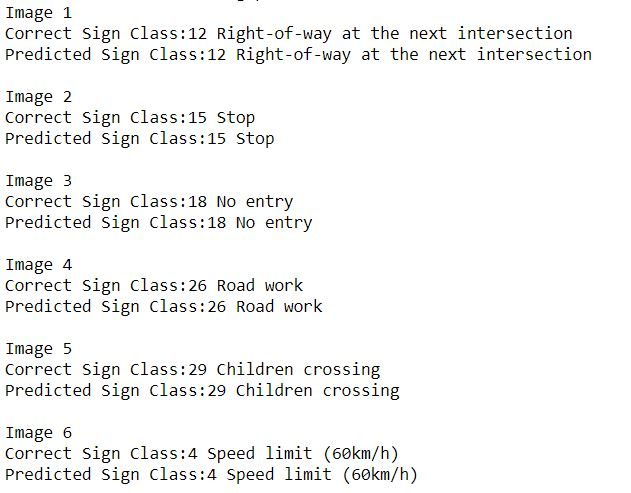
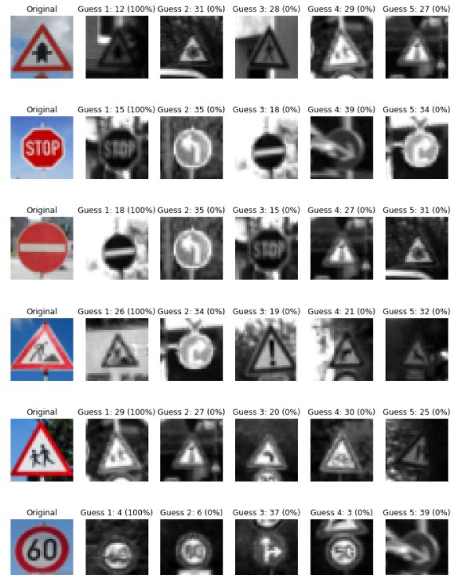

## Rubric Points
Here I will consider the [rubric points](https://review.udacity.com/#!/rubrics/481/view) individually and describe how I addressed each point in my implementation.  

---
### Writeup / README

#### 1. Provide a Writeup / README that includes all the rubric points and how you addressed each one. You can submit your writeup as markdown or pdf. You can use this template as a guide for writing the report. The submission includes the project code.

You're reading it! and here is a link to my [project code](https://github.com/wolf-zchen/Udacity-Traffic-Sign-Classifier/blob/master/Traffic_Sign_Classifier.ipynb)

### Data Set Summary & Exploration

#### 1. Provide a basic summary of the data set. In the code, the analysis should be done using python, numpy and/or pandas methods rather than hardcoding results manually.

I used the pandas library to calculate summary statistics of the traffic
signs data set:

* The size of training set is 34799
* The size of the validation set is 4410
* The size of test set is 12630
* The shape of a traffic sign image is （32,32,3）
* The number of unique classes/labels in the data set is 43

#### 2. Include an exploratory visualization of the dataset.

Here is an exploratory visualization of the data set. It is a bar chart showing how the data are distributed. It shows that the examples in classes are not evenly distributed. Some classes have more cases than other classes. This may have effect on the final result. The final results shows that this is ok.

Also note that some image in the dataset can not display normally(for example, some images are complete black), maybe there are bad image in the data set, which will hurt the performance.

### Design and Test a Model Architecture

#### 1. Describe how you preprocessed the image data. What techniques were chosen and why did you choose these techniques? Consider including images showing the output of each preprocessing technique. Pre-processing refers to techniques such as converting to grayscale, normalization, etc. (OPTIONAL: As described in the "Stand Out Suggestions" part of the rubric, if you generated additional data for training, describe why you decided to generate additional data, how you generated the data, and provide example images of the additional data. Then describe the characteristics of the augmented training set like number of images in the set, number of images for each class, etc.)

As a first step, I decided to convert the images to grayscale because color increases the complexity of the model. Transfer the image to grayscale can reduce the complexity and save time during training the model, especially when GPU is not available.

As a last step, I normalized the image data because to the range (-1,1) - This was done using the line of code X_train_normalized = (X_train - 128)/128. The resulting dataset mean wasn't exactly zero. I choose the this normalization method mainly because it is recommended in the first place.

- The first grayscale transform method I used is cv2.cvtColor(), which after normalization, the mean is reduced from around 82 to roughly 1.22. 
- The second grayscale transform method I used is average (R+G+B/3), which after normalization, the mean is reduced from around 82 to roughly -0.35.

After I applied the second grayscale method, the performance was improved from 85% to 96% with same hyperparameters. I think this is because the second method can bring the mean closer to 0.

Here is an example of an original image, grayscale transformation and an normalized image:

#### 2. Describe what your final model architecture looks like including model type, layers, layer sizes, connectivity, etc.) Consider including a diagram and/or table describing the final model.

My final model consisted of the following layers:

| Layer         		|     Description	        					|     num of parameters	    |
|:---------------------:|:---------------------------------------------:|-----------------------------------------------|
| Input         		| 32x32x1 normalized grayscale image   	    	| 0   	    |
| Convolution 5x5     	| 1x1 stride, valid padding, outputs 28x28x6 	| 156 |
| RELU					|												|  |
| Max pooling	      	| 2x2 stride,  outputs 14x14x6 				    | 0 				   |
| Convolution 5x5	    | 1x1 stride, valid padding, outputs 10x10x16 	| 416 |
| RELU					|												|												|
| Max pooling	      	| 1x1 stride,  outputs 10x10x16 			    | 0 			   |
| Convolution 5x5	    | 1x1 stride, valid padding, outputs 6x6x32 	| 832 |
| RELU					|												|												|
| Max pooling	      	| 1x1 stride,  outputs 6x6x32 				    | 0 				   |
| Flatten       		| outputs 1152  								| 0  							|
| Fully connected		| 1152 to 300  									| 345601  			|
| Dropout				| 75% keep										| 										|
| Fully connected		| 300 to 200  									| 60001  				|
| Dropout				| 75% keep										| 										|
| Fully connected		| 200 to 43  									| 8601  			|

#### 3. Describe how you trained your model. The discussion can include the type of optimizer, the batch size, number of epochs and any hyperparameters such as learning rate.

To train the model, I used an CNN for the most part is given in LeNet(this course) and image-classification project (Deep Learning Nanodegree). I used the AdamOptimizer with a learning rate of 0.0005. The epochs used was 20 while the batch size was 128. I mainly played around with learning rate. I start from 0.001 and saw the validation accuracy bounced around after a few epochs, so I decreased the learning rate, and finally choose 0.0005.

#### 4. Describe the approach taken for finding a solution and getting the validation set accuracy to be at least 0.93. Include in the discussion the results on the training, validation and test sets and where in the code these were calculated. Your approach may have been an iterative process, in which case, outline the steps you took to get to the final solution and why you chose those steps. Perhaps your solution involved an already well known implementation or architecture. In this case, discuss why you think the architecture is suitable for the current problem.

My final model results were:

- training set accuracy of 100%

- validation set accuracy of 96.5% 

- test set accuracy of 94.7%

If an iterative approach was chosen:

- What was the first architecture that was tried and why was it chosen?
**I used similar architecture as shown in lecture because they got good result and the most of the code are already given.**

- What were some problems with the initial architecture? **the problem I have was lack of knowledge of all the parameters and also the network is not deep enough.**

- How was the architecture adjusted and why was it adjusted? Typical adjustments could include choosing a different model architecture, adding or taking away layers (pooling, dropout, convolution, etc), using an activation function or changing the activation function. One common justification for adjusting an architecture would be due to overfitting or underfitting. A high accuracy on the training set but low accuracy on the validation set indicates over fitting; a low accuracy on both sets indicates under fitting. **I added one more convolution and max pooling and relu layer to make the model deeper**

- Which parameters were tuned? How were they adjusted and why? **Epoch, learning rate, batch size, and drop out probability were all parameters were tuned. For Epoch, I first started with a large number 30, and reduced to 20 when I had confidence that I could reach my accuracy goals. The batch size I used 128 which is a common number and didn't change since I got good results with 128. For the learning rate, I start from 0.001 and saw the validation accuracy bounced around after a few epochs, so I decreased the learning rate, and finally choose 0.0005. The dropout probability mattered a lot early on, but after a while I set it to 75% and just left it.**

- What are some of the important design choices and why were they chosen? For example, why might a convolution layer work well with this problem? How might a dropout layer help with creating a successful model? **I think this is a question that could take me weeks to study. The general idea I got is to keep the CNN deeper instead of wider to help increase the accuracy.**

If a well known architecture was chosen:
* What architecture was chosen? 
	* CNN network was chosen.
* Why did you believe it would be relevant to the traffic sign application?
	* CNN has been successfully applied to analyzing visual imagery. It uses relatively little pre-processing compared to other classification algorithms, which can save calculation power. This is necessary for self driving car since it need to make decisions quickly.
* How does the final model's accuracy on the training, validation and test set provide evidence that the model is working well?
	* The model got 100% training accuracy, 95%+ validation and test accuracy, and the new images tested all been correctly classified.

### Test a Model on New Images

#### 1. Choose five German traffic signs found on the web and provide them in the report. For each image, discuss what quality or qualities might be difficult to classify.

Here are six German traffic signs that I found on the web:

Based on the results they were all classified correctly with 100% on the first guess

#### 2. Discuss the model's predictions on these new traffic signs and compare the results to predicting on the test set. At a minimum, discuss what the predictions were, the accuracy on these new predictions, and compare the accuracy to the accuracy on the test set (OPTIONAL: Discuss the results in more detail as described in the "Stand Out Suggestions" part of the rubric).

Here are the results of the prediction:

The model was able to correctly guess 6 of the 6 traffic signs, which gives an accuracy of 100%. This compares favorably to the accuracy on the test set of 94.4%.

####3. Describe how certain the model is when predicting on each of the five new images by looking at the softmax probabilities for each prediction. Provide the top 5 softmax probabilities for each image along with the sign type of each probability. (OPTIONAL: as described in the "Stand Out Suggestions" part of the rubric, visualizations can also be provided such as bar charts)

The answer to this question is below:

